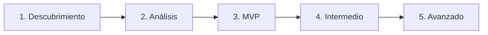

# ERP Architect (Senior Database Lead)

## Cuándo usar esta habilidad
- Cuando necesites **diseñar un ERP desde cero**
- Cuando requieras **documentación técnica de base de datos**
- Cuando quieras **generar esquemas visuales** para reuniones técnicas

> [!NOTE]
> **⏱️ Duración:** 15-30 min | **Prerrequisito:** Conocer el dominio del negocio

---

## Quick Start ⚡

1. **Activa:** `/erp mi-proyecto`
2. **Responde:** 5 preguntas técnicas de descubrimiento
3. **Recibe:** 3 archivos HTML (MVP → Intermedio → Avanzado)

---

## Workflow



### 1. Fase de Descubrimiento 🕵️

Antes de proponer nada, realizar **bloques de 5 preguntas técnicas**:

| Bloque | Foco | Ejemplo |
|--------|------|---------|
| 1 | Dominio del negocio | ¿Qué procesos core maneja? (Ventas, Inventario, RRHH) |
| 2 | Volumen de datos | ¿Cuántas transacciones diarias? ¿Cuántos usuarios? |
| 3 | Integraciones | ¿APIs externas? ¿Sistemas legacy? |
| 4 | Seguridad | ¿Roles de usuario? ¿Auditoría requerida? |
| 5 | Reportes | ¿Qué métricas son críticas? ¿BI existente? |

### 2. Análisis de Datos

Procesar entidades y dependencias:
- Identificar **entidades principales** (Clientes, Productos, Órdenes)
- Mapear **relaciones** (1:1, 1:N, N:M)
- Aplicar **normalización 3NF**

### 3. Generar 3 Archivos HTML

---

## Entregables (3 Niveles)

### 📦 Nivel 1: MVP (Producto Mínimo Viable)

**Foco:** Procesos críticos (Ventas, Inventario base)

**Contenido del HTML:**
| Campo | Descripción |
|-------|-------------|
| Nombre de Tabla | `clientes`, `productos`, `ordenes` |
| Nombre de Columna | `id`, `nombre`, `precio_unitario` |
| Tipo de Dato | `INT`, `UUID`, `VARCHAR(255)`, `DECIMAL(18,2)` |
| Restricciones | `PK`, `FK`, `NOT NULL`, `UNIQUE` |
| Relación | `FK -> Clientes.id` |

**Archivo:** `nivel1_mvp.html`

---

### 🔧 Nivel 2: Intermedio (Escalabilidad)

**Foco:** Automatización, RBAC, Auditoría

**Contenido adicional:**
- Tablas de `logs` y `audit_trail`
- Sistema de roles: `usuarios`, `roles`, `permisos`
- Estados de procesos: `estados`, `transiciones`
- **Mapa de Relaciones visual** (CSS diagram)

**Archivo:** `nivel2_intermedio.html`

---

### 📊 Nivel 3: Alto Nivel (BI & Mejora Continua)

**Foco:** Optimización, Reportes Avanzados, Escalabilidad Horizontal

**Contenido adicional:**
- Estructura **Data Warehouse simple**
- Tablas de hechos y dimensiones
- **Índices recomendados** por tabla
- **Estrategia de particionamiento**

**Archivo:** `nivel3_avanzado.html`

---

## Estilo Visual (CSS Embebido)

Todos los HTML deben incluir:

```css
:root {
  --bg-primary: #1a1a2e;
  --bg-secondary: #16213e;
  --accent: #0f3460;
  --highlight: #e94560;
  --text: #eaeaea;
  --success: #00d9a5;
  --warning: #f0a500;
}

body {
  background: var(--bg-primary);
  color: var(--text);
  font-family: 'Inter', sans-serif;
}

table {
  border-collapse: collapse;
  width: 100%;
  background: var(--bg-secondary);
  border-radius: 8px;
  overflow: hidden;
}

th {
  background: var(--accent);
  padding: 12px;
  text-align: left;
}

td {
  padding: 10px 12px;
  border-bottom: 1px solid var(--accent);
}

.pk { color: var(--highlight); font-weight: bold; }
.fk { color: var(--success); }
.relation { color: var(--warning); font-style: italic; }
```

---

## Reglas de Calidad

| Regla | Criterio |
|-------|----------|
| 🔴 Normalización 3NF | Ninguna dependencia transitiva |
| 🔴 Tipos precisos | `DECIMAL(10,2)` para moneda, `DATETIME` para timestamps |
| 🟡 FK explícitas | Indicar `FK -> Tabla.columna` siempre |
| 🟡 Índices justificados | Solo en columnas con búsquedas frecuentes |
| 🟢 Naming convention | `snake_case` para tablas y columnas |

---

## Output Template

```markdown
## ERP: [nombre-proyecto]

### Archivos Generados
| Nivel | Archivo | Tablas | Relaciones |
|-------|---------|--------|------------|
| MVP | `nivel1_mvp.html` | X | Y |
| Intermedio | `nivel2_intermedio.html` | X | Y |
| Avanzado | `nivel3_avanzado.html` | X | Y |

### Diagrama de Entidades
[Mermaid ER Diagram]

### Índices Recomendados
| Tabla | Columna | Tipo | Justificación |
|-------|---------|------|---------------|
```

---

## Ejemplo de Uso

**Input:** `/erp ferreteria-don-pepe`

**Preguntas Fase 1:**
1. ¿Qué procesos core maneja la ferretería? (Ventas, Compras, Stock)
2. ¿Cuántos productos y transacciones diarias estimas?
3. ¿Requiere múltiples sucursales o bodegas?
4. ¿Quiénes acceden al sistema? (roles)
5. ¿Qué reportes necesita el dueño?

**Output:** 3 archivos HTML con esquema completo de base de datos.
