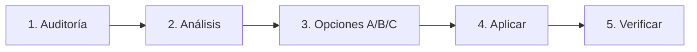

# Mejorar Skills

## Cuándo usar esta habilidad
- Cuando un skill **no genera el output esperado**
- Cuando el **workflow es confuso** o tiene pasos duplicados
- Cuando **falta documentación** o ejemplos claros

> [!NOTE]
> **⏱️ Duración:** 5-10 min | **Cuándo NO usarlo:** Para crear skills nuevos → usar `creador-de-skills`

## Quick Start ⚡

1. **Abre** el formulario: `formulario-mejora_v12.html`
2. **Responde** las preguntas (marca "Ayuda" si tienes dudas)
3. **Aplica** → Copia el resultado y pídele al agente que lo implemente

**One-liner:** `/mejorar brainstorming-pro`

---

## Workflow



### 1. Auditoría Profunda 🕵️
Antigravity debe:
1. Leer todos los archivos del skill target
2. Analizar estructura, código y documentación
3. **Generar tabla con 10 Propuestas de Mejora** (Problema → Solución)

### 2. Análisis y Compliance
- Leer SKILL.md y verificar YAML, estructura, carpetas
- **Auto-Proposal:** Explicar qué falta si la validación falla

### 3. Modo Diseñador (3 Opciones)
Para cada mejora, Antigravity presenta 3 propuestas (A, B, C) con checkboxes. El usuario elige una, varias o ninguna.

### 4. Aplicar Mejoras
- Ejecutar opciones seleccionadas
- Priorizar 🔴 alto impacto primero
- Incorporar comentarios del usuario
- Actualizar SKILL.md

### 5. Verificar Compliance
- Validar estructura final
- Confirmar que el skill funciona como se espera

---

## Las 10 Preguntas

### 📊 Diagnóstico (1-3)

| # | Pregunta | Tipo | Por qué importa |
|---|----------|------|-----------------|
| 1 | Nivel de satisfacción (1-5) | Única | Baseline para medir mejora |
| 2 | Áreas que necesitan mejora | Múltiple | Foco del trabajo |
| 3 | Problemas específicos detectados | Múltiple | Diagnóstico preciso |

### 🛠️ Acción (4-6)

| # | Pregunta | Tipo | Por qué importa |
|---|----------|------|-----------------|
| 4 | Tipo de mejora (quick fix / refactor) | Múltiple | Determina alcance |
| 5 | Qué debería añadirse/eliminarse | Múltiple | Cambios concretos |
| 6 | Comportamiento deseado | Múltiple | Define el éxito |

### 🎯 Resultado (7-10)

| # | Pregunta | Tipo | Por qué importa |
|---|----------|------|-----------------|
| 7 | Coordinación con otros skills | Múltiple | Evita conflictos |
| 8 | Formato del resultado | Múltiple | Alinea expectativas |
| 9 | Prioridad de implementación | Única | Ordena el trabajo |
| 10 | ¿Aplicar o revisar? | Única | Cierra el loop |

---

## Reglas de Calidad

| Regla | Criterio de Éxito |
|-------|-------------------|
| 🔴 Priorizar alto impacto | Afecta output > Afecta estructura > Afecta documentación |
| 🤖 Detección automática | El skill decide tipo de mejora según respuestas |
| 🔗 Sugerir relacionados | Al finalizar, proponer otros skills a mejorar |
| 🚫 Sin redundancia | Preguntas únicas, no repetir conceptos |
| ⏱️ Timeout 30s | Si no hay respuesta, aplicar mejora por defecto |

---

## Output

```markdown
## Mejoras aplicadas a `[skill-name]`

### 🔴 Alto impacto
- ✅ [Cambio] → [Por qué]

### 🟡 Medio impacto
- ✅ [Cambio] → [Por qué]

### 🟢 Bajo impacto
- ✅ [Cambio] → [Por qué]

### ❌ Descartado
- [Cambio no aplicado] → [Motivo]

### Skills relacionados a mejorar
| Skill | Motivo |
|-------|--------|
| `X` | [Por qué] |
```

---

## Ejemplos de Mejoras

| Skill | Problema | Cambio | Resultado | ⏱️ |
|-------|----------|--------|-----------|-----|
| [brainstorming-pro](file:///c:/Users/vaule/Desktop/Prueba%20G-Anti/.agent/skills/brainstorming-pro/SKILL.md) | Output genérico | Añadir formato: Idea + Paso + Tiempo | 2→4 ⭐ | 8 min |
| [planificacion-pro](file:///c:/Users/vaule/Desktop/Prueba%20G-Anti/.agent/skills/planificacion-pro/SKILL.md) | Workflow confuso | Dividir en 4 fases claras | 3→5 ⭐ | 12 min |
| [estilo-marca](file:///c:/Users/vaule/Desktop/Prueba%20G-Anti/.agent/skills/estilo-marca/SKILL.md) | No se activa | Añadir trigger: "textos visibles" | 3→4 ⭐ | 5 min |
| [creador-de-skills](file:///c:/Users/vaule/Desktop/Prueba%20G-Anti/.agent/skills/creador-de-skills/SKILL.md) | YAML incompleto | Añadir campos obligatorios | 3→5 ⭐ | 6 min |
| [modo-produccion](file:///c:/Users/vaule/Desktop/Prueba%20G-Anti/.agent/skills/modo-produccion/SKILL.md) | Checklist largo | Reducir a 10 items críticos | 3→4 ⭐ | 7 min |
