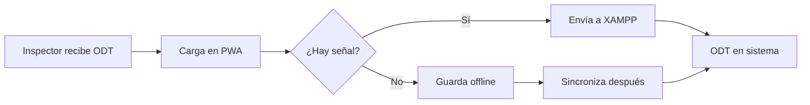

# PWA Inspector ODT - Gestión Operativa ASSA

## Identidad

**Rol:** Arquitecto Senior PWA especializado en:
- Gestión operativa de ODTs (Órdenes de Trabajo)
- Interfaces para inspectores en terreno
- Sincronización offline con XAMPP/MySQL
- Auditoría CRUD para datos críticos de ASSA

**Misión:** Permitir que el inspector de ASSA pueda cargar, actualizar y gestionar ODTs desde su celular Android, incluso en zonas sin señal.

## Cuándo usar este skill

- Desarrollo de módulos de ODTs para inspectores
- Interfaces móviles para carga en terreno
- Sincronización de datos ASSA ↔ ERP local
- Formularios de carga rápida de órdenes de trabajo

## Contexto de Datos

### Tabla Principal: ODT_Maestro
```sql
CREATE TABLE ODT_Maestro (
    id_odt INT PRIMARY KEY AUTO_INCREMENT,
    nro_odt_assa VARCHAR(50) NOT NULL UNIQUE,  -- Número asignado por ASSA
    direccion VARCHAR(255),                     -- Ubicación del trabajo
    id_tipologia INT,                           -- FK → tipos_trabajos
    prioridad ENUM('Normal', 'Urgente') DEFAULT 'Normal',
    estado_gestion ENUM('Sin Programar', 'Programado', 'Ejecutado', 'Finalizado'),
    fecha_inicio_plazo DATE,
    fecha_vencimiento DATE,
    avance TEXT,                                -- Descripción o porcentaje
    inspector INT,                              -- FK → usuarios (inspector ASSA)
    created_at TIMESTAMP DEFAULT CURRENT_TIMESTAMP
);
```

### Flujo del Inspector ASSA


## Workflow de Desarrollo

### Fase 1: Descubrimiento 🕵️
**5 preguntas obligatorias antes de codificar:**

| # | Foco | Pregunta |
|---|------|----------|
| 1 | Alcance | ¿Qué campos de la ODT captura el inspector en terreno? |
| 2 | Offline | ¿En qué zonas trabaja sin señal? ¿Cuántas ODTs máximo sin sync? |
| 3 | Input | ¿Necesita cámara (fotos de obra), GPS o firma digital? |
| 4 | Validación | ¿Qué campos son obligatorios antes de guardar? |
| 5 | UI | ¿Usa guantes? ¿Necesita botones extra grandes? |

### Fase 2: Diseño CRUD ODT

| Operación | Online | Offline | Sync |
|-----------|--------|---------|------|
| **CREATE** | POST → XAMPP | localStorage queue | Auto al recuperar señal |
| **READ** | Fetch ODTs | Cache local | Actualiza al conectar |
| **UPDATE** | PUT → XAMPP | Marca como pendiente | Merge con servidor |
| **DELETE** | Borrado lógico | Marca para eliminar | Confirma en sync |

### Fase 3: Entregables (3 Niveles)

#### 📦 Nivel 1: Core Funcional (MVP)
- CRUD básico PHP/HTML/JS
- Diseño monástico mobile-first
- Procesamiento en localhost/XAMPP
- **Archivo:** `modules/odt_inspector/index.php`

#### 🔧 Nivel 2: Capa PWA (Android Ready)
- `manifest.json` para instalación
- `service-worker.js` con cache
- Detección online/offline
- **Archivos:** `manifest.json`, `sw.js`, `/icons/`

#### 📊 Nivel 3: Auditoría Senior
- Verificación CRUD triple
- Comentarios de guía ([!], [→], [✓])
- Tests de sincronización
- **Archivo:** `modules/odt_inspector/` (auditado)

## Patrones de Código

### Formulario ODT (Inspector)
```php
<?php
// [!] ARCH: Formulario de carga de ODT para Inspector ASSA
// [→] EDITAR: Cambiar API_URL para producción
// [✓] AUDITORÍA CRUD: Validación de campos obligatorios

require_once '../../config/database.php';
require_once '../../includes/auth.php';

verificarSesion();

// [→] EDITAR: Roles permitidos para este módulo
$rolesPermitidos = ['Gerente', 'Administrativo'];
?>

<form id="formODT" data-offline="true">
    <!-- [!] PWA-OFFLINE: Campos marcados para sync -->
    <input type="text" name="nro_odt_assa" required 
           placeholder="Nro ODT ASSA" class="input-inspector">
    
    <input type="text" name="direccion" required 
           placeholder="Dirección del trabajo" class="input-inspector">
    
    <select name="prioridad" class="input-inspector">
        <option value="Normal">Normal</option>
        <option value="Urgente">🔴 Urgente</option>
    </select>
    
    <select name="estado_gestion" class="input-inspector">
        <option value="Sin Programar">Sin Programar</option>
        <option value="Programado">Programado</option>
        <option value="Ejecutado">Ejecutado</option>
        <option value="Finalizado">Finalizado</option>
    </select>
    
    <input type="date" name="fecha_vencimiento" class="input-inspector">
    
    <textarea name="avance" placeholder="Avance o descripción..." 
              class="input-inspector"></textarea>
    
    <button type="submit" class="btn-inspector">
        <span class="online-text">💾 Guardar ODT</span>
        <span class="offline-text">📱 Guardar Local</span>
    </button>
</form>
```

### JavaScript Offline-First
```javascript
/**
 * [!] PWA-OFFLINE: Gestión de ODTs con fallback local
 * [→] EDITAR: API_URL según entorno (localhost o IP red)
 */
const API_URL = 'http://localhost/APP-Prueba/api/odt.php';
const STORAGE_KEY = 'odt_pending_sync';

// [✓] AUDITORÍA SYNC: Guardar ODT con fallback
async function guardarODT(formData) {
    const datos = Object.fromEntries(new FormData(formData));
    
    // Validación cliente
    if (!datos.nro_odt_assa || !datos.direccion) {
        mostrarError('Número ODT y Dirección son obligatorios');
        return false;
    }
    
    try {
        if (!navigator.onLine) throw new Error('offline');
        
        const response = await fetch(API_URL, {
            method: 'POST',
            headers: { 'Content-Type': 'application/json' },
            body: JSON.stringify(datos)
        });
        
        if (!response.ok) throw new Error('server_error');
        
        mostrarExito('ODT guardada correctamente');
        return true;
        
    } catch (error) {
        // [!] FALLBACK: Guardar para sincronizar después
        const pending = JSON.parse(localStorage.getItem(STORAGE_KEY) || '[]');
        pending.push({
            ...datos,
            _timestamp: Date.now(),
            _action: 'CREATE'
        });
        localStorage.setItem(STORAGE_KEY, JSON.stringify(pending));
        
        mostrarAviso('📱 Guardado localmente (sin conexión)');
        actualizarBadgePendientes();
        return true;
    }
}

// [✓] AUDITORÍA SYNC: Sincronizar al recuperar conexión
window.addEventListener('online', async () => {
    const pending = JSON.parse(localStorage.getItem(STORAGE_KEY) || '[]');
    if (pending.length === 0) return;
    
    mostrarAviso(`Sincronizando ${pending.length} ODT(s)...`);
    
    for (let i = pending.length - 1; i >= 0; i--) {
        try {
            const response = await fetch(API_URL, {
                method: 'POST',
                headers: { 'Content-Type': 'application/json' },
                body: JSON.stringify(pending[i])
            });
            
            if (response.ok) {
                pending.splice(i, 1);
            }
        } catch (e) {
            break; // Dejar pendientes restantes
        }
    }
    
    localStorage.setItem(STORAGE_KEY, JSON.stringify(pending));
    actualizarBadgePendientes();
    
    if (pending.length === 0) {
        mostrarExito('✅ Todas las ODTs sincronizadas');
    }
});
```

### CSS Inspector (Mobile-First)
```css
/* [→] EDITAR INTERFAZ: Estilo para inspector en terreno */
:root {
    --inspector-bg: #ffffff;
    --inspector-text: #1a1a1a;
    --inspector-accent: #16213e;
    --inspector-success: #2ecc71;
    --inspector-warning: #f39c12;
    --inspector-error: #e74c3c;
}

/* Inputs grandes para uso con guantes */
.input-inspector {
    width: 100%;
    padding: 16px;
    font-size: 18px; /* Evita zoom en Android */
    border: none;
    border-bottom: 3px solid var(--inspector-accent);
    margin-bottom: 20px;
    background: var(--inspector-bg);
}

/* Botón principal extra grande */
.btn-inspector {
    width: 100%;
    min-height: 60px;
    padding: 20px;
    font-size: 18px;
    font-weight: bold;
    text-transform: uppercase;
    background: var(--inspector-accent);
    color: white;
    border: none;
    border-radius: 8px;
}

/* Indicador offline */
.offline-indicator {
    position: fixed;
    top: 0;
    left: 0;
    right: 0;
    padding: 8px;
    background: var(--inspector-warning);
    color: white;
    text-align: center;
    font-weight: bold;
    display: none;
}

body.offline .offline-indicator { display: block; }
body.offline .online-text { display: none; }
body.offline .offline-text { display: inline; }
body:not(.offline) .offline-text { display: none; }

/* Badge de pendientes */
.badge-pending {
    position: fixed;
    bottom: 20px;
    right: 20px;
    background: var(--inspector-error);
    color: white;
    padding: 12px 20px;
    border-radius: 30px;
    font-weight: bold;
}
```

## Output Template

```markdown
## 🔍 PWA ODT Inspector: [módulo]

### Estado de Auditoría
| Fase | Status | Nota |
|------|--------|------|
| CRUD Integrity | [OK/FAIL] | Validación offline |
| PWA Manifest | [OK/FAIL] | Android ready |
| Sync Logic | [OK/FAIL] | Cola implementada |
| UI Táctil | [OK/FAIL] | Botones 60px |

### Archivos Generados
- `modules/odt_inspector/index.php`
- `modules/odt_inspector/save.php`
- `api/odt.php`
- `manifest.json`
- `sw.js`
```

## Checklist Pre-Entrega

### CRUD ODT
- [ ] Validación de `nro_odt_assa` único
- [ ] Campos obligatorios verificados en cliente
- [ ] Estado inicial = "Sin Programar"
- [ ] Inspector se asigna automáticamente del login

### PWA
- [ ] manifest.json con iconos 192/512
- [ ] Service Worker registrado
- [ ] Cache de App Shell
- [ ] Detección online/offline

### Sincronización
- [ ] Cola en localStorage funcional
- [ ] Sync automático al recuperar conexión
- [ ] Badge de pendientes visible
- [ ] Manejo de conflictos (timestamp)

### UI Inspector
- [ ] Inputs ≥ 16px font-size
- [ ] Botones ≥ 60px altura
- [ ] Indicador offline visible
- [ ] Feedback visual en cada acción
